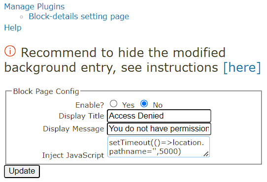
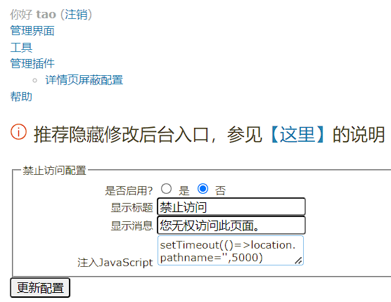
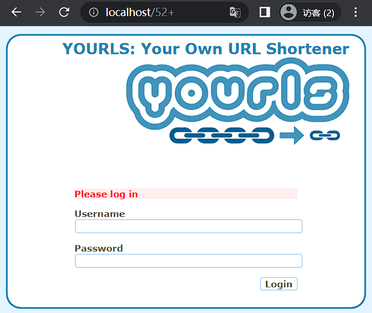
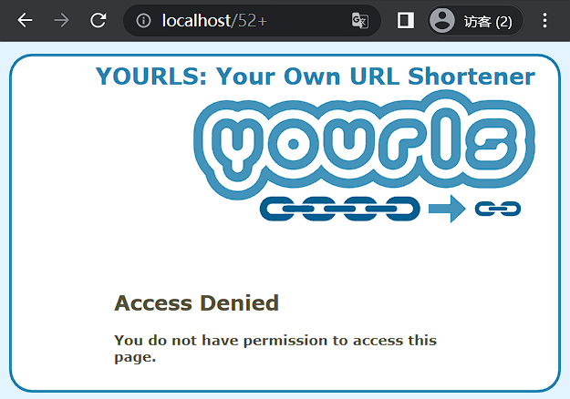

# block-details-while-not-login | 未登录时屏蔽详情页
a plugin for [YOURLS](https://yourls.org/), block details page while not login

[YOURLS](https://yourls.org/) 的插件，在未登录时屏蔽详情页

# Feature | 特性

## Multilingual | 多语言
| English | 中文 |
|:--:|:--:|
||  下不赘述|
> PS: Currently, only Simplified Chinese is supported

## Safty | 安全

| Before \| 曾经 | Now \| 现状 |
|:--:|:--:|
|||
| :x: Risk of brute-force attacks and malicious requests | :white_check_mark: Safe! |
| :x: 后台存在爆破和恶意请求风险 | :white_check_mark: 安全！|

## Customization | 自定义

|  |  |
|:--:|:--:|

Custom reminder text support, you can do much more with JS insertion

支持自定义提醒文本，JS植入可以做更多的事情

> The image shows an example of a jump to the home page after 5 seconds
> 
> 图片上显示的是5秒后跳转到主页的例子

# Usage | 使用

Install YOURLS, install this plugin, activate the plugin and enable it in the configuration

安装YOURLS，安装插件，打开插件，配置里启用

> 正如插件配置页说的那样，推荐隐藏修改后台入口，参见[【这里】](https://github.com/YOURLS/YOURLS/pull/2747#issuecomment-689047797)
> 
> As writen in the plugin configuration page, it is recommended to hide the modification backend entry, see [[here]](https://github.com/YOURLS/YOURLS/pull/2747#issuecomment-689047797)

---

PS: YOURLS最新版的汉化也是我，可以访问[我的翻译仓库](https://github.com/taozhiyu/yourls-translation-zh_CN)