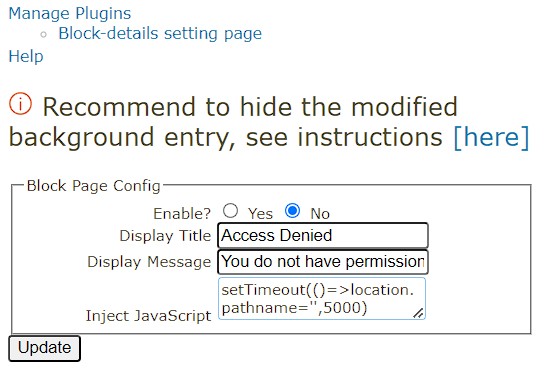
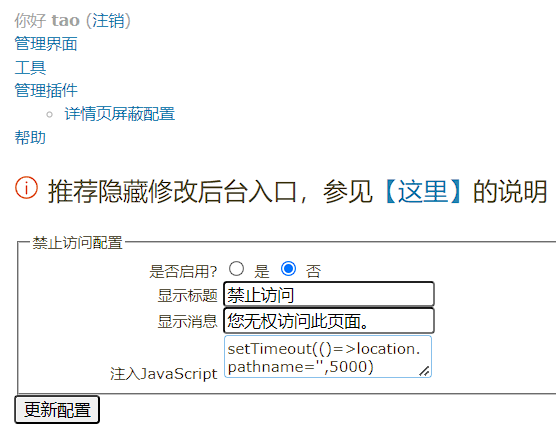
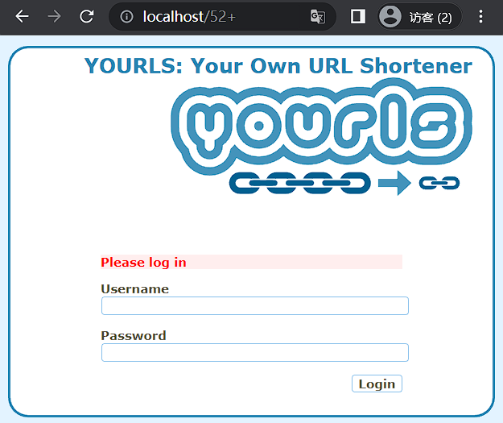
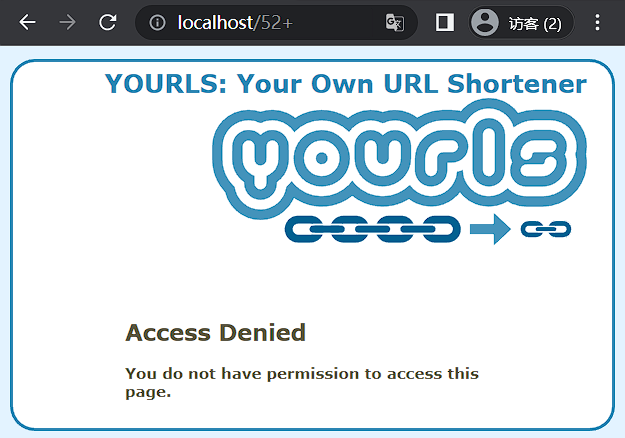

# block-details-while-not-login | 未登录时屏蔽详情页

[YOURLS](https://yourls.org/) 的插件，在未登录时屏蔽详情页。

> 🇬🇧 English version: [README.md](README.md)

## 特性

### 多语言

| English | 中文 |
|:--:|:--:|
|  |  |

> 目前除英文外仅支持简体中文。

### 安全

| 曾经 | 现状 |
|:--:|:--:|
|  |  |
| :x: 后台存在爆破和恶意请求风险 | :white_check_mark: 安全！|

### 自定义

|  |  |
|:--:|:--:|

支持自定义提醒文本，JS 植入可以做更多的事情。

> 图片上显示的是 5 秒后跳转到主页的例子。

## 使用

1. 安装 YOURLS。
2. 将本插件放入 `user/plugins/` 目录。
3. 在 **管理插件** 页面启用本插件。
4. 在插件配置页中开启屏蔽。

> 正如插件配置页说的那样，推荐隐藏修改后台入口，参见 [YOURLS PR #2747 中的 #689047797 评论](https://github.com/YOURLS/YOURLS/pull/2747#issuecomment-689047797)。

---

PS: YOURLS 最新版的汉化也是我维护的，可以访问 [我的翻译仓库](https://github.com/taozhiyu/yourls-translation-zh_CN)。
